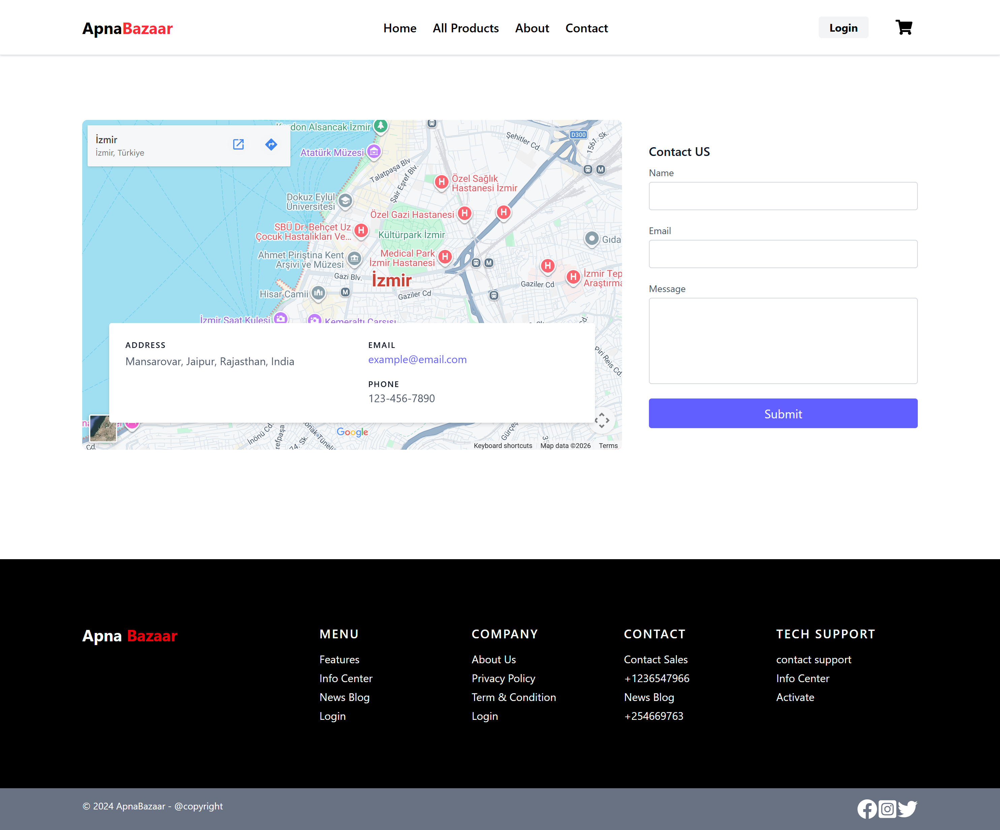
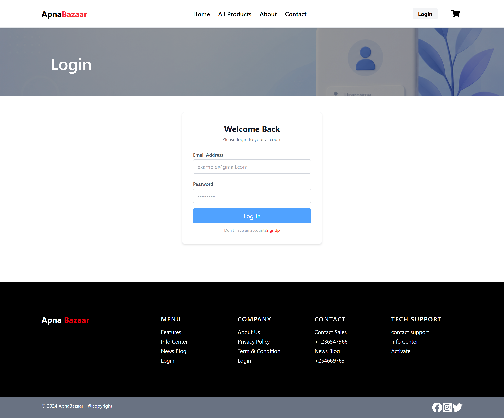
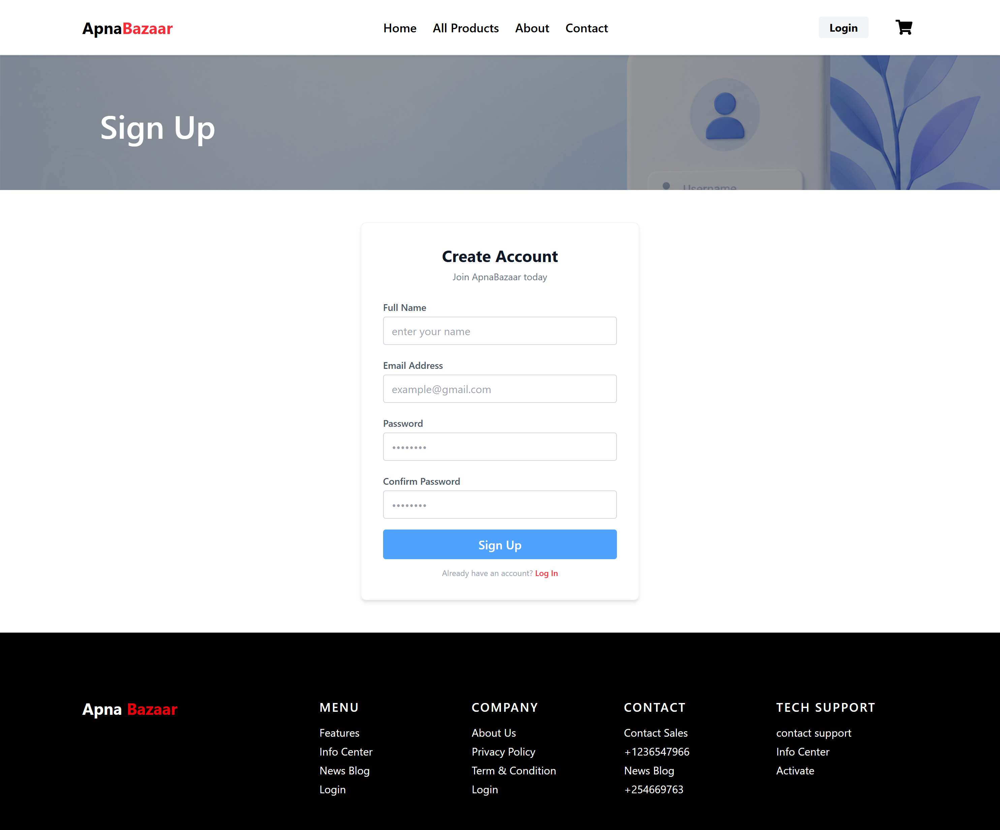
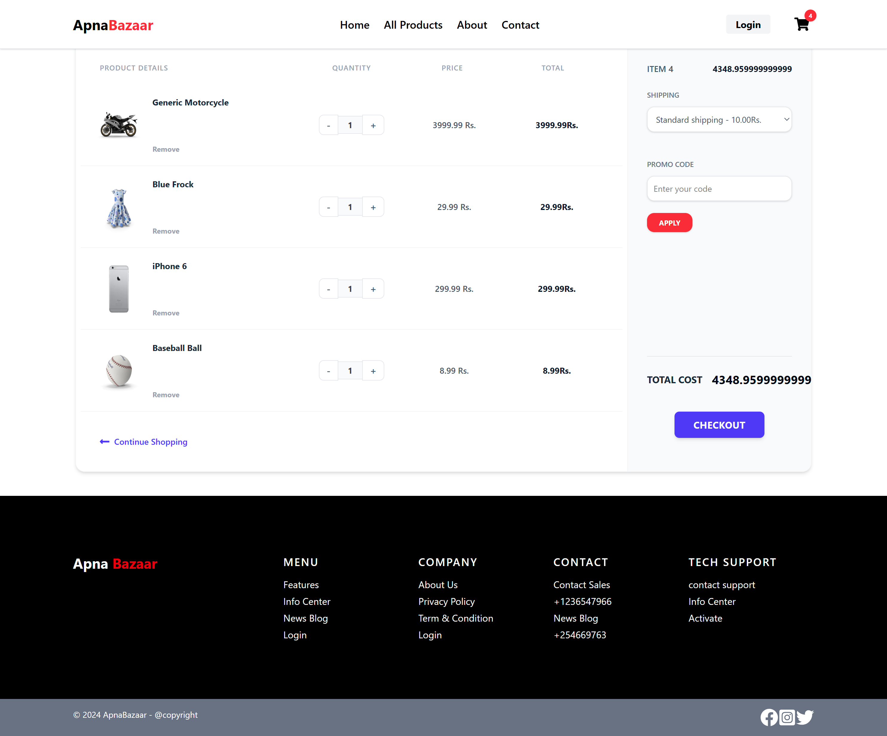

# 🛍️ ApnaBazaar — Enterprise-Grade Component-Driven E-Commerce Ecosystem

 A high-performance, asynchronous digital marketplace delivering seamless item indexing, cloud-backed user lifecycles, and fully responsive fluid viewports.

---

## 📖 About the Project

**ApnaBazaar** is a production-ready, highly modular e-commerce architecture engineered to bridge local commerce with a modern digital client interface. It connects users with everyday household essentials, modern electronics, and fashion trends by transforming raw backend database entries into fully interactive visual elements.

Unlike traditional static web layouts, ApnaBazaar is built from the ground up to solve critical real-world state management challenges, asynchronous concurrency lag, and data vulnerability across the browser window.


---
## 📸 Screenshots

### 🏠 Home Page

<p align="center">
  
</p>

###  All Products

<p align="center">
  
</p>

###  About

<p align="center">
  
</p>

###  Contact

<p align="center">
  
</p>

###  Login

<p align="center">
  
</p>

###  SignUp

<p align="center">
  
</p>

###  Shopping Cart

<p align="center">
  
</p>


---

---

## ✨ Features

### 👤 Customer Facing Features

- **Responsive Landing Page Layout:** 
- **Sticky Navigation Header Bar:** 
- **Hero Slider Billboard Section:** 
- **Exclusive Multi-Category Marketplace Grid:** 
- **Asymmetrical Collections Gallery Grid:** 
- **Interactive Service Trust Infographics:** 
- **Dynamic Swiper Feedback Sliders:** 
- **Live Keyword Search Engine:** 
- **Granular Category Filters:** 
- **Dual-Bound Price Matrix Adjustments:** 
- **One-Click State Engine Resets:** 
- **Extended Dynamic Product Profile Pages:** 
- **Live Synchronized Cart Indicator Badges:** 
- **Granular Multi-Action Shopping Cart Page:** 
- **Automated Duplicate Ingestion Filters:** 
- **Conditional Interface State Fallbacks:** 
- **Active Promotional Code Engine:**  
- **Flat-Rate Automatic Logistics Calculator:**  
- **Geospatial Embedded Mapping Interface:** 
- **Asynchronous Firebase Authentication Gateway:** 

### 🔐 Security & Database Management Features

- **Serverless Cloud Document Pipelines:** 
- **Continuous Session Observers:** 
- **Rigid Client-Side Password Appraisals:** 
- **Asynchronous Exception Translation Maps:** 
- **Controlled Input Checkout Modals:** 
- **10-Digit Phone Registry Constraints:** 
- **High-Fidelity Layout Skeleton Pulses:** 


---

## 📂 Project Directory Structure


```text
e-commerce/
└── src/
    ├── assets/             
    ├── FirebaseAuth/       
    │   ├── AllProducts/    
    │   ├── CardEmpty/      
    │   ├── Contact/        
    │   ├── Footer/          
    │   ├── Gallery/         
    │   ├── HeroSection/    
    │   ├── Modal/          
    │   ├── Navbar/         
    │   ├── PopularProducts/ 
    │   ├── Service/         
    │   └── Testimonials/   
    ├── pages/              
    │   ├── Cart/          
    │   ├── Home/           
    │   ├── Login/           
    │   ├── SignUp/         
    │   └── SingleProduct/   
    ├── App.jsx              
             
```

---

## 📱 Responsive Design

The application is fully responsive and works smoothly on:

- 💻 Desktop
- 📱 Mobile
- 📟 Tablet

---


## 🛠️ Tech Stack Used

- **React.js:** 
- **JavaScript (ES6+):**
- **Tailwind CSS:** 
- **React Router DOM:**
- **Google Firebase Engine:** 
- **Axios Framework:** .
- **Swiper.js Module:** 
- **Flowbite React UI:** 
- **React Hot Toast:** 
- **DummyJSON Engine:** 

---


## 👩‍💻 Author

**Shivani Tyagi**

GitHub: https://github.com/Shivani1228

